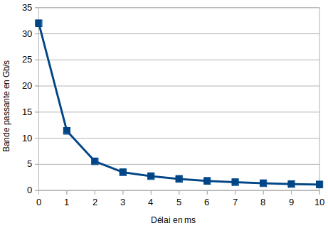
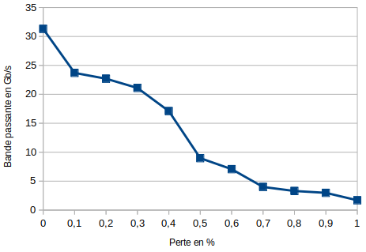
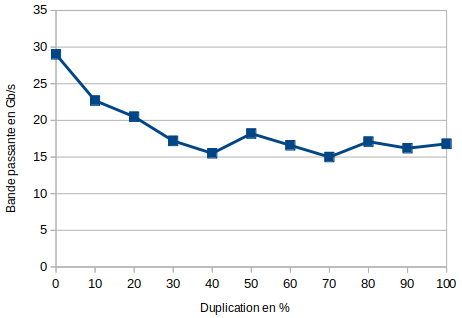
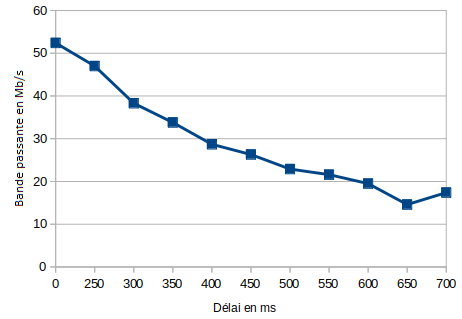
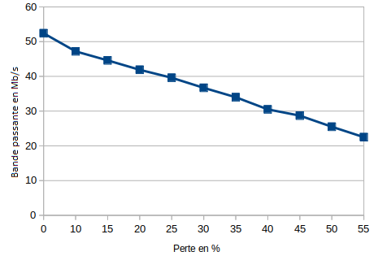
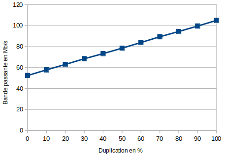

### TD4 M3108 LAFORGE Samuel 18/12/19

## 1. Installation de l'environnement de test

1) Je commence par installer iperf :
```
apt install iperf
```

Je test quelques commandes données sur le site Wikipedia : (ici par exemple je lance un serveur)

```
root@debian:~# iperf -s -u -B 225.0.1.2
------------------------------------------------------------
Server listening on UDP port 5001
Binding to local address 225.0.1.2
Joining multicast group  225.0.1.2
Receiving 1470 byte datagrams
UDP buffer size:  208 KByte (default)
------------------------------------------------------------
```

2) Le script simul.sh permet de créer un network name space. Je le lance donc de la façon suivante :
```
root@debian:~# chmod +x simul.sh 
root@debian:~# ./simul.sh  10.12.0.1 10.12.0.2
No command specified, using /bin/sh

# ip a        
1: lo: <LOOPBACK> mtu 65536 qdisc noop state DOWN group default qlen 1000
    link/loopback 00:00:00:00:00:00 brd 00:00:00:00:00:00
5: veth-server@if4: <BROADCAST,MULTICAST,UP,LOWER_UP> mtu 1500 qdisc noqueue state UP group default qlen 1000
    link/ether fa:7d:ea:a8:69:01 brd ff:ff:ff:ff:ff:ff link-netnsid 0
    inet 10.12.0.1/24 scope global veth-server
       valid_lft forever preferred_lft forever
    inet6 fe80::f87d:eaff:fea8:6901/64 scope link 
       valid_lft forever preferred_lft forever
```

En faisant un ip a je peux voir que ma carte réseau virutelle est bien crée avec l'adresse IP de mon serveur

## 2. Réalisation des graphes "xy"
### 2.1. Graphes en TCP

1) Je lance un serveur iperf grâce à la commande suivante :
```
root@debian:~# ./simul.sh 10.12.0.1 10.12.0.2 'iperf -B 10.12.0.1 -s'
------------------------------------------------------------
Server listening on TCP port 5001
Binding to local address 10.12.0.1
TCP window size: 85.3 KByte (default)
------------------------------------------------------------
```
2) J'ouvre un nouveau terminal et je me connecte à ma VM
Une fois dans ma VM je connecte un client iperf sur le serveur avec la commande suivante :
```
root@debian:~# iperf -c 10.12.0.1
------------------------------------------------------------
Client connecting to 10.12.0.1, TCP port 5001
TCP window size: 85.0 KByte (default)
------------------------------------------------------------
[  3] local 10.12.0.2 port 44808 connected with 10.12.0.1 port 5001
[ ID] Interval       Transfer     Bandwidth
[  3]  0.0-10.0 sec  46.2 GBytes  39.6 Gbits/sec
```

Je vois que sur le serveur il y a bien eu une connexion
```
[  4] local 10.12.0.1 port 5001 connected with 10.12.0.2 port 44808
[ ID] Interval       Transfer     Bandwidth
[  4]  0.0-10.0 sec  46.2 GBytes  39.6 Gbits/sec
```

Maintenant sur le client je vois qu'une carte réseau virutelle a été crée :
```
10: veth-client@if11: <BROADCAST,MULTICAST,UP,LOWER_UP> mtu 1500 qdisc noqueue state UP group default qlen 1000
    link/ether ee:99:b2:dd:47:37 brd ff:ff:ff:ff:ff:ff link-netns latency-network
    inet 10.12.0.2/24 scope global veth-client
       valid_lft forever preferred_lft forever
    inet6 fe80::ec99:b2ff:fedd:4737/64 scope link 
       valid_lft forever preferred_lft forever
```

3) On ouvre un nouveau terminal et on se reconnecte à la VM
Une fois connecté à la VM je vais utiliser le script add_penalty.sh pour générer des problèmes dans mon réseau virtuel
En créant des erreurs je vais réaliser des graphes et les comparer

Délai en TCP :

Je commence le premier graphe en jouant avec le délai :
Je fais les délais suivants : 100ms, 200ms, 300ms, 400ms, 500ms, 600ms, 700ms, 800ms, 900ms, 1000ms
J'obtiens donc le graphe suivant :

 

Je remarque que le délai entraîne la perte du débit petit à petit

Perte en TCP :

Maintenant je vais créer des pertes de paquets en pourcentage (de 0 à 50%) :

 

**La perte est tellement grande sur les 20 premiers pourcents qu'on ne la voit pas sur le graphe**
Je remarque aussi qu'à partir de 80% le client n'arrive mêm plus à se connecter au serveur

Duplication en TCP :

Je termine enfin avec la duplication des paquets (de 0 à 50%) :

 

Je remarque que la duplication des paquets n'affecte pa la bande passante. Ceci ce fait car les paquets en double ne sont simplement pas pris en compte

### 2.2. Graphe en UDP

Je lance maintenant le serveur mais en UDP (avec précision de la bande passante) et je refais les graphes :
```
root@debian:~# ./simul.sh 10.12.0.1 10.12.0.2 'iperf -B 10.12.0.1 -s -u -b 50M'
------------------------------------------------------------
Server listening on UDP port 5001
Binding to local address 10.12.0.1
Receiving 1470 byte datagrams
UDP buffer size:  208 KByte (default)
------------------------------------------------------------
```

Pour toutes les opérations sur le client je fais :
```
iperf -B 10.12.0.1 -c -u -b 50M
```
Délai en UDP :

Cette fois ci en UDP avec la duplication les valeurs de la bande passante vont changer.



Pertes en UDP :



Duplication en UDP :



Cette fois-ci la duplication augmente le débit. Ceci est normal car en UDp il n'y a pas de connexion. Tous les paquets passent sans exeptions.